<p align="center">
  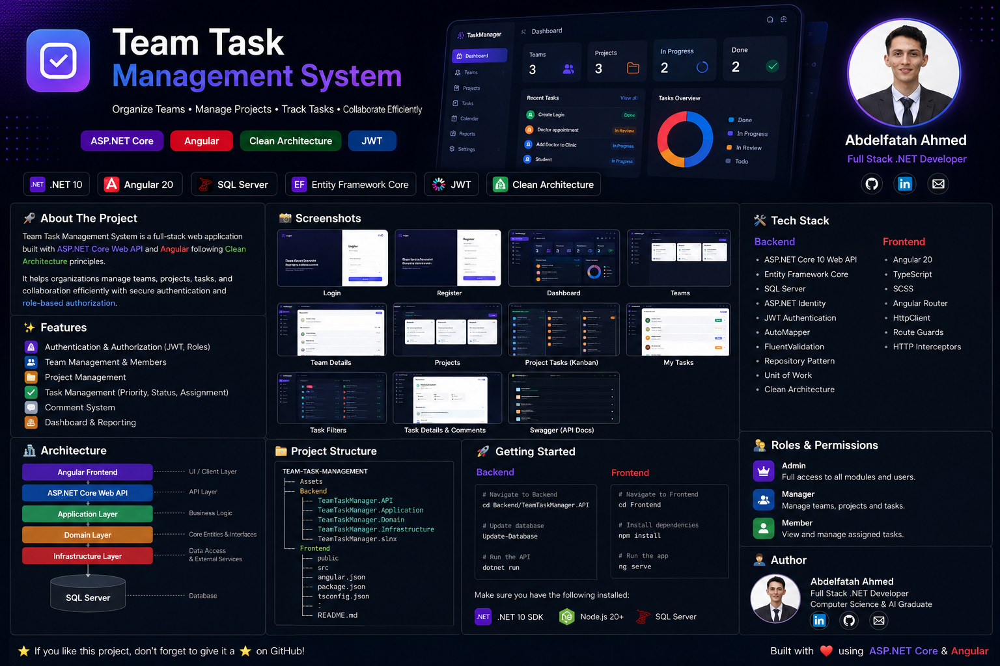
</p>

<h1 align="center">🚀 Team Task Management System</h1>

<p align="center">
A modern <b>Full Stack Team Task Management System</b> built with
<b>ASP.NET Core Web API</b> and <b>Angular</b> following
<b>Clean Architecture</b> principles.
</p>

<p align="center">


</p>

---

# 📖 About

Team Task Management System is a full-stack project designed to help organizations organize their workflow through **Teams**, **Projects**, **Tasks**, and **Comments**.

The application provides a complete management solution with secure authentication, role-based authorization, project tracking, task assignment, dashboard analytics, and collaboration between team members.

The backend is built using **ASP.NET Core Web API** with **Clean Architecture**, while the frontend is developed using **Angular**.

---

# ✨ Features

## 🔐 Authentication

- User Registration
- User Login
- JWT Authentication
- Password Hashing
- Secure APIs
- Authorization Policies

---

## 👥 Role-Based Authorization

The system supports three roles:

| Role | Permissions |
|------|-------------|
| 👑 Admin | Full access to the entire system |
| 📋 Manager | Manage Teams, Projects and Tasks |
| 👨‍💻 Member | Manage assigned tasks and comments |

---

# 👥 Team Management

- ✅ Create Team
- ✅ Update Team
- ✅ Delete Team
- ✅ View Teams
- ✅ View Team Details
- ✅ Add Members
- ✅ Remove Members

---

# 📁 Project Management

- ✅ Create Project
- ✅ Update Project
- ✅ Delete Project
- ✅ View Projects
- ✅ View Project Details
- ✅ Assign Project to Team
- ✅ Project Status

---

# ✅ Task Management

- Create Tasks

- Update Tasks

- Delete Tasks

- Assign Tasks

- Task Priorities

- Task Status

- Due Dates

- Task Filters

- Kanban Board

- My Tasks

---

# 💬 Comments

Every task has its own discussion section.

Users can:

- Add Comment
- View Comments
- Delete Comment

---

# 📊 Dashboard

The dashboard displays:

- Total Teams
- Total Projects
- Tasks In Progress
- Completed Tasks
- Recent Projects
- Recent Tasks

Real-time statistics make project tracking much easier.

---

# 🛠 Tech Stack

## Backend

- ASP.NET Core Web API
- .NET 10
- Entity Framework Core
- SQL Server
- ASP.NET Identity
- JWT Authentication
- AutoMapper
- FluentValidation
- Repository Pattern
- Unit Of Work
- Clean Architecture

---

## Frontend

- Angular 20
- TypeScript
- SCSS
- Angular Router
- HttpClient
- Route Guards
- HTTP Interceptors
- Reactive Forms

---

# 🏛 Architecture

The project follows **Clean Architecture**.

```
Presentation Layer (Angular)

↓

ASP.NET Core Web API

↓

Application Layer

↓

Domain Layer

↓

Infrastructure Layer

↓

SQL Server
```

---

# 📂 Project Structure

<p align="center">
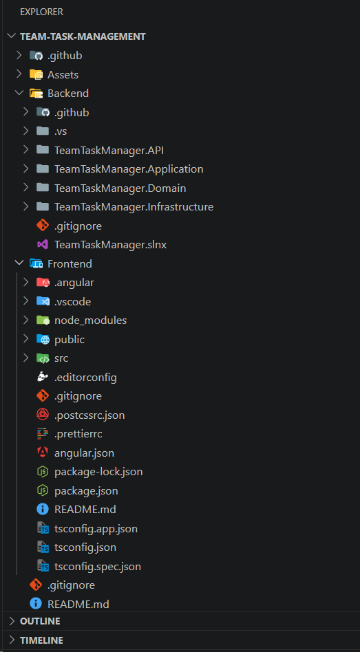
</p>

```text
Team-Task-Management

│

├── Backend
│
│ ├── TeamTaskManager.API
│ ├── TeamTaskManager.Application
│ ├── TeamTaskManager.Domain
│ └── TeamTaskManager.Infrastructure
│
├── Frontend
│
├── Assets
│
└── README.md
```
---

# 📸 Application Screenshots

## 🔐 Authentication

<table>
<tr>
<td align="center">

### Login

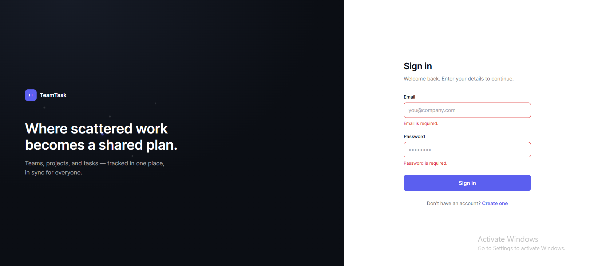

</td>

<td align="center">

### Register

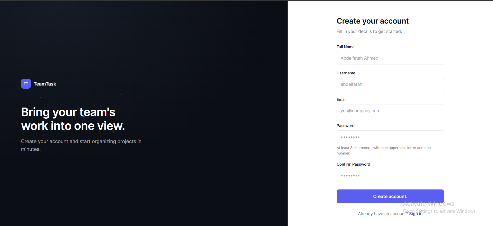

</td>
</tr>
</table>

---

## 📊 Dashboard

<p align="center">
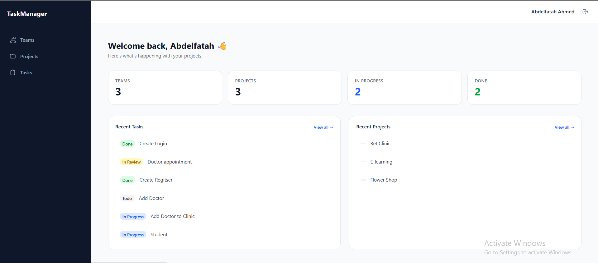
</p>

The dashboard provides a quick overview of:

- Total Teams
- Total Projects
- Tasks In Progress
- Completed Tasks
- Recent Projects
- Recent Tasks

---

## 👥 Team Management

<table>
<tr>

<td align="center">

### Teams

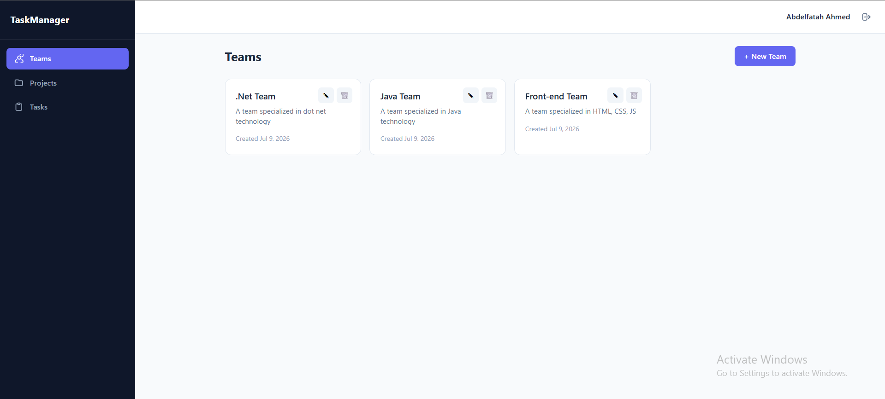

</td>

<td align="center">

### Team Details

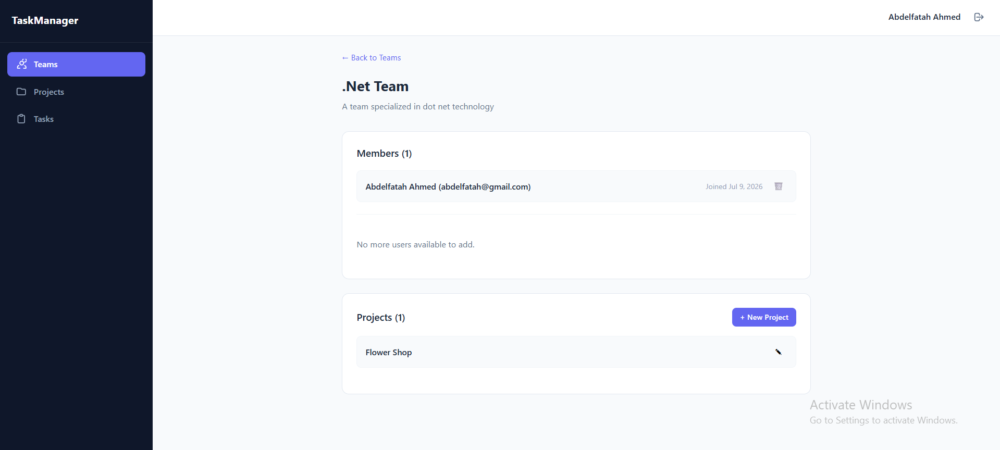

</td>

</tr>
</table>

Features:

- Create Team
- Edit Team
- Delete Team
- View Team Details
- Add Members
- Remove Members

---

## 📁 Project Management

<table>
<tr>

<td align="center">

### Projects

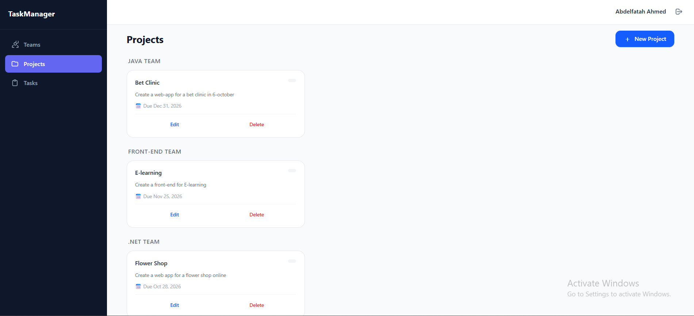

</td>

<td align="center">

### Project Details

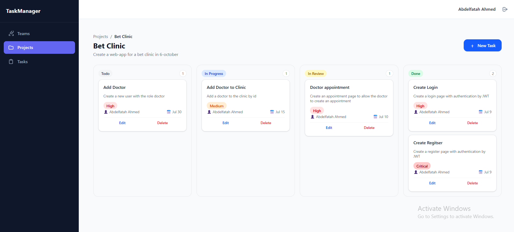

</td>

</tr>
</table>

Features:

- Create Project
- Update Project
- Delete Project
- Assign Team
- Project Status
- Due Date

---

## ✅ Task Management

### Kanban Board

<p align="center">

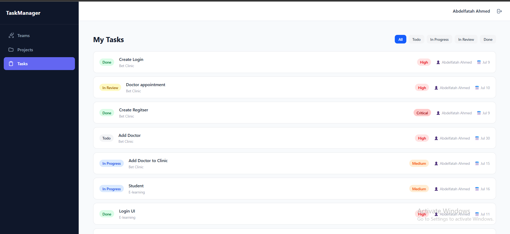

</p>

---

### My Tasks

<p align="center">

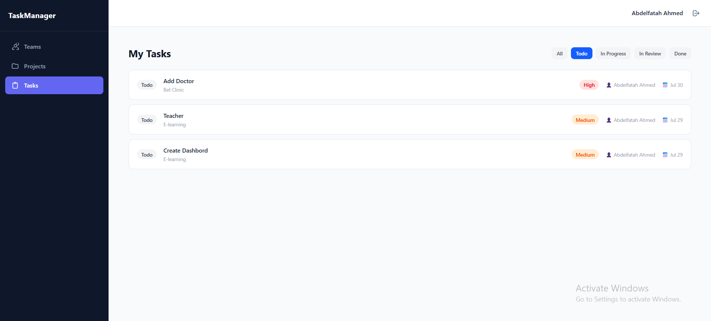

</p>

Features:

- Task Filters
- Task Status
- Priority
- Assigned User
- Due Date
- Personal Tasks

---

## 💬 Task Details & Comments

<table>
<tr>

<td>

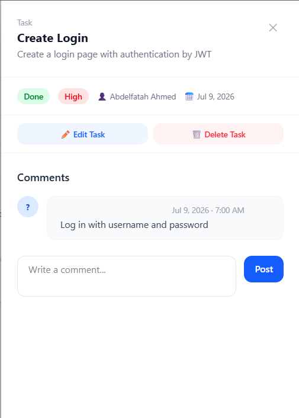

</td>

<td>

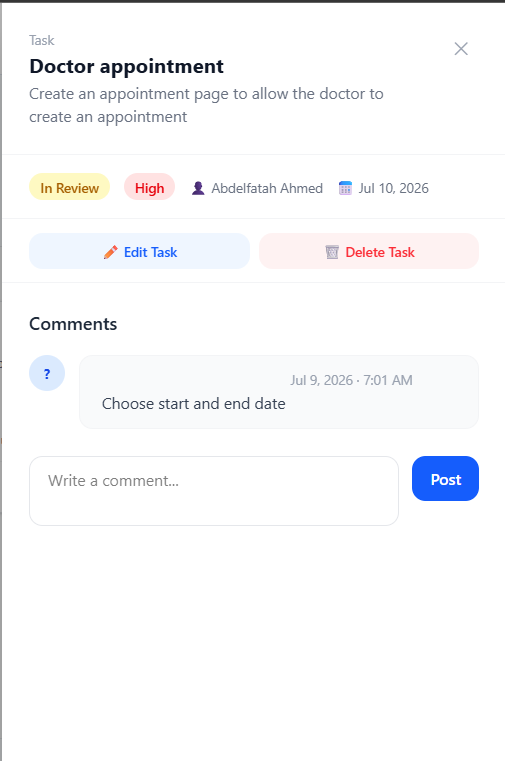

</td>

</tr>
</table>

Users can:

- View Task Details
- Add Comments
- Read Discussion
- Delete Comments

---

# 📑 API Documentation

Swagger is integrated with the project for testing all endpoints.

<table>

<tr>

<td>

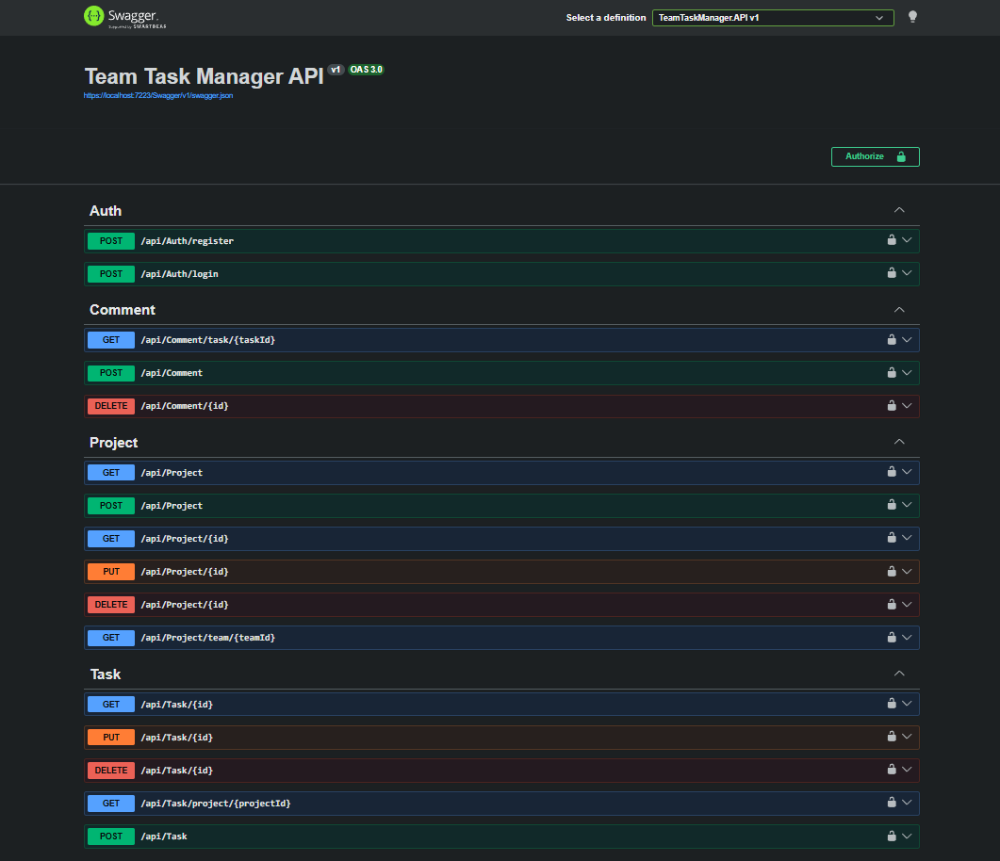

</td>

<td>

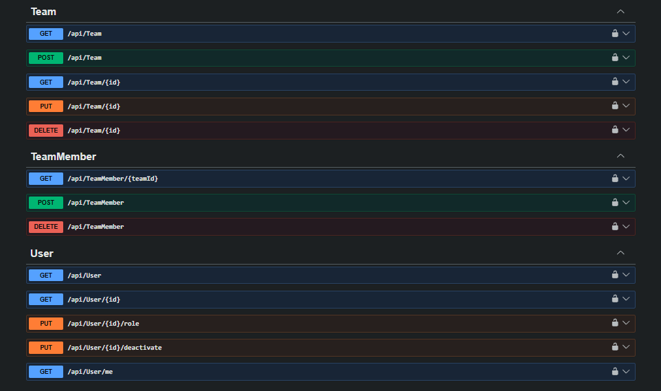

</td>

</tr>

</table>

---

# 🚀 Getting Started

## Backend

```bash
cd Backend/TeamTaskManager.API

Update-Database

dotnet run
```

---

## Frontend

```bash
cd Frontend

npm install

ng serve
```

---

Open

```
http://localhost:4200
```

Backend

```
https://localhost:7223/swagger
```

---

# 🔌 API Modules

The API contains complete CRUD operations for:

- Authentication
- Users
- Teams
- Team Members
- Projects
- Tasks
- Comments

Every endpoint is protected using JWT Authentication and Role-Based Authorization.

---

# 📈 Highlights

✔ Clean Architecture

✔ Repository Pattern

✔ Unit Of Work

✔ FluentValidation

✔ AutoMapper

✔ JWT Authentication

✔ Role-Based Authorization

✔ Dashboard Analytics

✔ Angular Standalone Components

✔ Responsive UI

✔ SQL Server

✔ Entity Framework Core

---

# 👨‍💻 Author

<p align="center">


</p>

<h2 align="center">Abdelfatah Ahmed</h2>

<p align="center">

Full Stack .NET Developer

<br>

Computer Science & Artificial Intelligence Graduate

</p>

<p align="center">

<a href="https://github.com/Abdelfatah-147">

</a>

<a href="https://www.linkedin.com/in/abd-el-fatah-ahmed"> 

</a>

<a href="mailto:ta7a147@gmail.com">

</a>

</p>

---

# 📌 Future Improvements

Some planned features for future versions:

- Notifications
- File Attachments
- Activity Logs
- Email Notifications
- Calendar Integration
- Team Chat
- Search & Filtering
- Dark Mode
- Reports
- Export to Excel / PDF

---

# 🤝 Contributing

Contributions are welcome.

If you'd like to improve this project:

```bash
Fork the repository

Create your feature branch

Commit your changes

Push to your branch

Open a Pull Request
```

---

# ⭐ Support

If you like this project,

please consider giving it a ⭐ on GitHub.

It really helps.

---

# 📄 License

This project was created for educational and portfolio purposes.

---

<p align="center">

## ❤️ Built with ASP.NET Core & Angular

</p>

<p align="center">


</p>

---

<p align="center">

### ⭐ If you found this project useful, don't forget to leave a star ⭐

</p>

<p align="center">

Made with ❤️ by **Abdelfatah Ahmed**

</p>